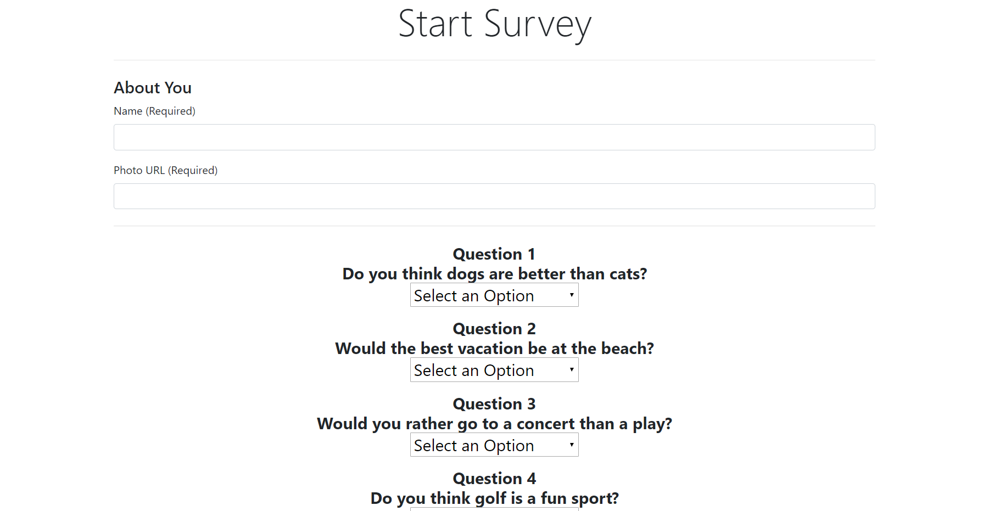

# Friend-Finder

     

     

## Table of Contents

* [About the Project](#about-the-project)
* [Built With](#built-with)
* [Installation](#installation)
* [Usage](#usage)

## About The Project

Friend Finder is an application made with Javascript, jQuery, Node.js and Express.js. This project is used to demonstrate using routes as well as GET and POST requests in order to send information from the web browser to  the server and vice versa.

## Built With
* [Node.js](https://nodejs.org/en/)
* [jQuery](https://jquery.com/)
* [Express.js](https://expressjs.com/)
* [Bootstrap](https://getbootstrap.com/)
* [Heroku](https://signup.heroku.com/t/platform?c=70130000001xDpdAAE&gclid=CjwKCAiAuK3vBRBOEiwA1IMhuut9uybKqSbPpKYLMp8tfuhyInCgcpq-20B_lTCC5lnr6-5m3Mng6BoCm2YQAvD_BwE)

## Usage

Opening up the link will provide with you a starting page where you will need to click the survey button. Then it will redirect you to the survey, fill out all of the input fields and the 10 questions below. Depending on your answers the application will find another person who had the person with the closest answer as you. This will display your match!

## Link To Friend Finder

Project Link : [https://glacial-cove-35124.herokuapp.com/](https://glacial-cove-35124.herokuapp.com/)

